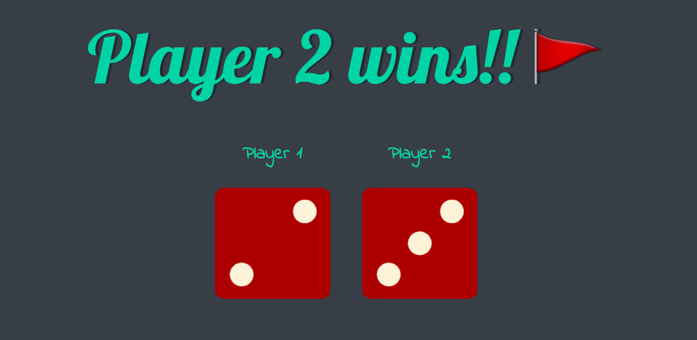

# **Play the dices**
#### Selecting and manipulating elements using the DOM and JavaScript to create a Dice Game
##### Every Time we refresh the web site the dice get thrown randomly , so that player 1 and player 2 both have their own values, and the web site Will announce a winner depending on whose dice value was higher

